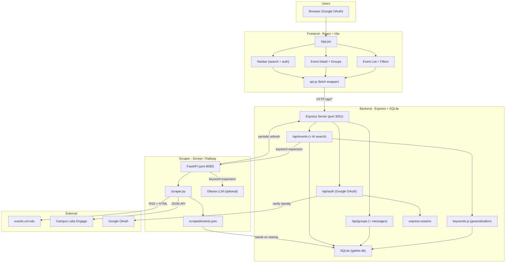
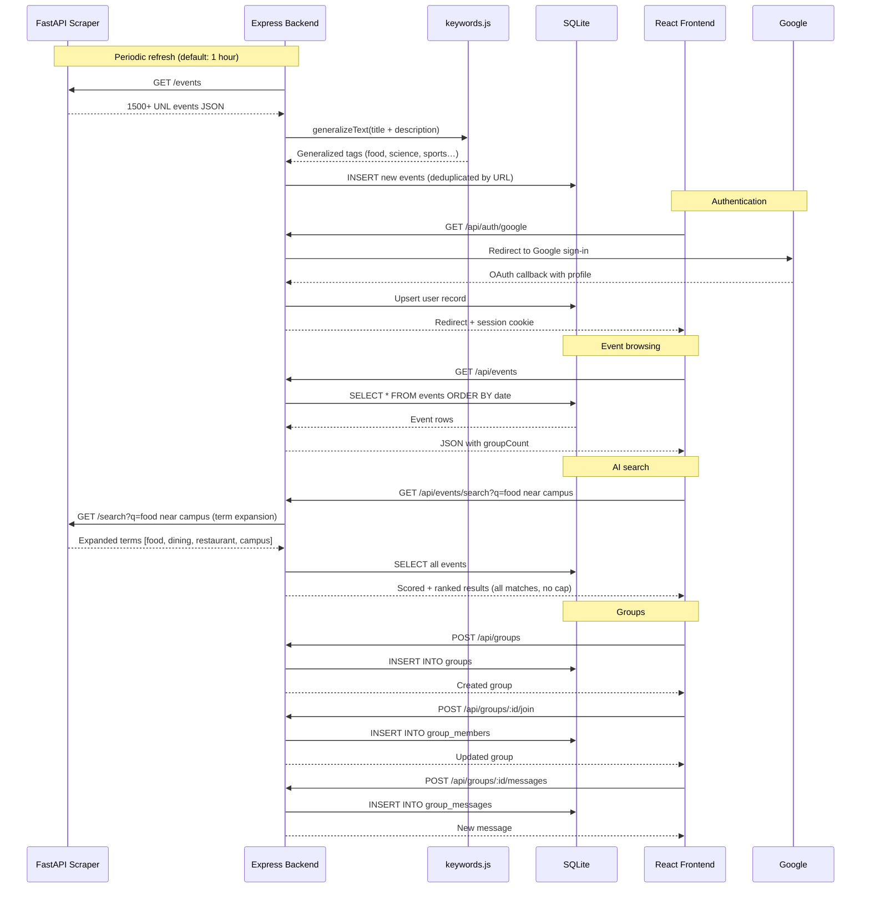
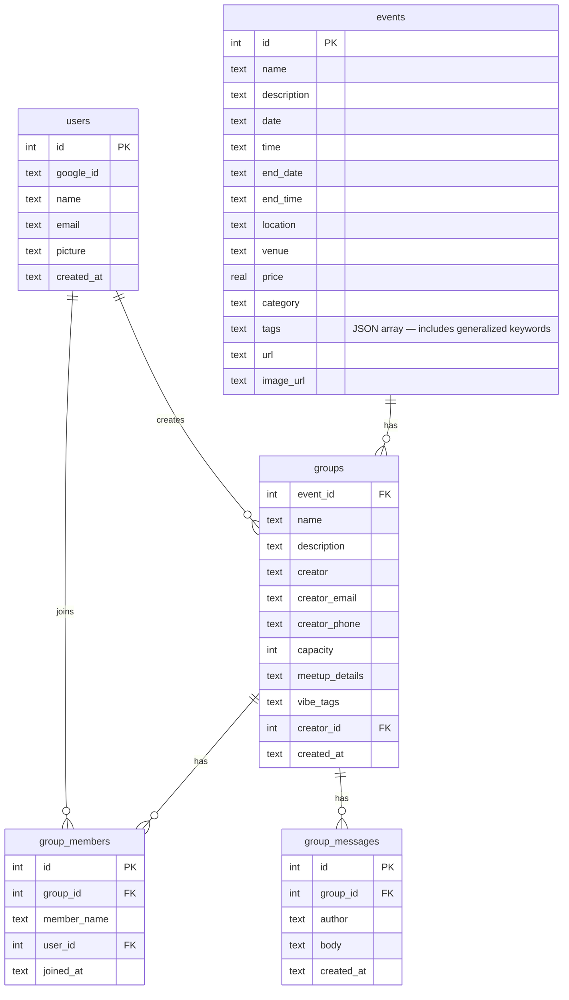

# Curia — Architecture

## System Overview



## Data Flow



## Database Schema



## Project Structure

```
Raikes-Hacks-2026/
├── frontend/                  # React + Vite
│   ├── src/
│   │   ├── App.jsx            # Main app — events, search, auth state
│   │   ├── api.js             # API client (fetch wrapper, credentials: include)
│   │   ├── components/
│   │   │   ├── Navbar.jsx         # Search bar + Google sign-in/out
│   │   │   ├── SearchFilters.jsx  # Category / date filters + pagination
│   │   │   ├── EventCard.jsx      # Event tile with image, date in CT
│   │   │   ├── EventDetail.jsx    # Full event view + group management
│   │   │   └── GroupModal.jsx     # Create/view group modal
│   │   └── index.css
│   └── vite.config.js         # Dev proxy: /api -> localhost:3001
│
├── backend/                   # Express + SQLite
│   ├── index.js               # Server entry, middleware, periodic refresh
│   ├── db.js                  # DB init, seeding, insertNewEvents()
│   ├── keywords.js            # Keyword generalization map (pizza→food, etc.)
│   └── routes/
│       ├── auth.js            # Google OAuth (passport-google-oauth20)
│       ├── events.js          # GET /api/events, search (AI scoring)
│       └── groups.js          # CRUD groups, join/leave, messages
│
├── api/                       # Python FastAPI scraper
│   ├── api.py                 # FastAPI app — /search, /events, /health, /reload
│   ├── scraper.py             # UNL RSS + Engage scraper
│   ├── search.py              # Keyword search + optional Ollama expansion
│   └── Dockerfile
│
├── scraped/events.json        # Scraper output — seeds SQLite on startup
├── .env.example               # Required environment variables
├── deploy.sh                  # One-command Railway deployment script
├── docker-compose.yml         # Local: Ollama + FastAPI + backend
└── railway.json               # Railway deployment config
```

## Search Architecture

Search works in two layers:

**Index time** (`keywords.js` + `db.js`): When events are inserted, their title and description are run through a generalization map that adds parent-category tags. An event mentioning "pizza" gets `["food", "dining"]` added to its tags. An event mentioning "biology" gets `["science", "stem"]`.

**Query time** (`routes/events.js` + FastAPI): When a search query comes in, it's sent to FastAPI for term expansion (using Ollama if available, raw tokenization otherwise). The expanded terms are then scored against every event's name (4×), venue (2×), category (2×), description (1×), and tags (1×). All matching events are returned ranked by score — no cap on results.

## Deployment (Railway)

Two Railway services:

| Service | Source | Description |
|---------|--------|-------------|
| `backend` | repo root (`railway.json`) | Express + React static build |
| `api` | `api/` directory | FastAPI scraper |

`deploy.sh` deploys both, detects the API service's public domain, and wires `FASTAPI_URL` / `EVENTS_API_URL` on the backend automatically.

Key production environment variables on the `backend` service:

| Variable | Value |
|----------|-------|
| `NODE_ENV` | `production` |
| `SESSION_SECRET` | (random string) |
| `GOOGLE_CLIENT_ID` | from Google Cloud Console |
| `GOOGLE_CLIENT_SECRET` | from Google Cloud Console |
| `GOOGLE_CALLBACK_URL` | `https://<backend-domain>/api/auth/google/callback` |
| `FRONTEND_URL` | `https://<backend-domain>` |
| `FASTAPI_URL` | `https://<api-domain>` |
| `EVENTS_API_URL` | `https://<api-domain>/events` |
