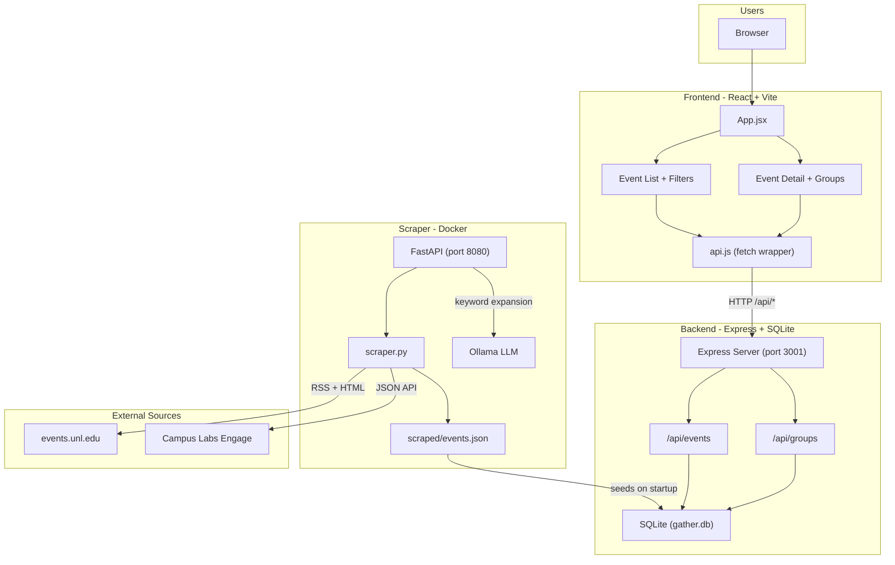
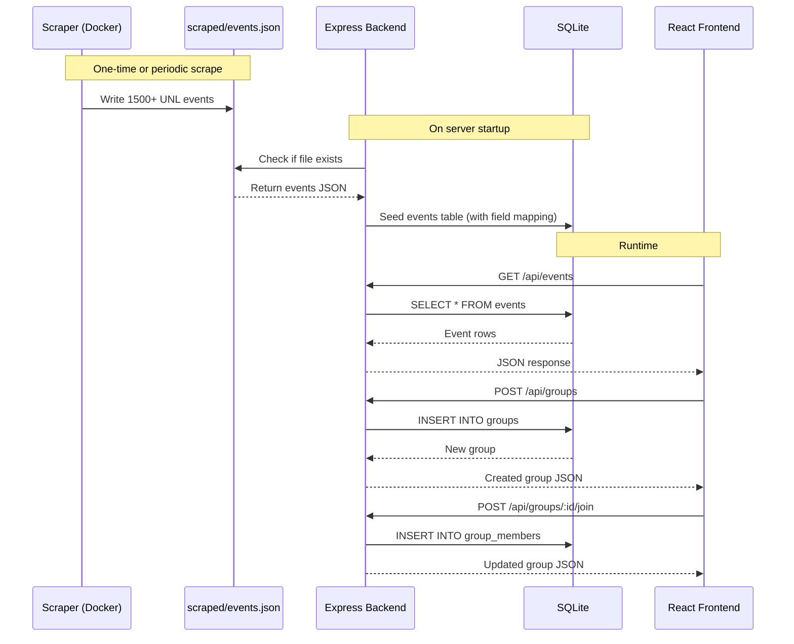
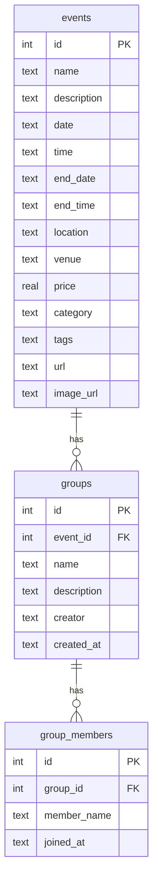

# Curia — Architecture

## System Overview



## Data Flow



## Database Schema



## Project Structure

```
Raikes-Hacks-2026/
├── frontend/                  # React + Vite
│   ├── src/
│   │   ├── App.jsx            # Main app — fetches events, routing
│   │   ├── api.js             # API client (fetch wrapper)
│   │   ├── components/
│   │   │   ├── Navbar.jsx
│   │   │   ├── SearchFilters.jsx
│   │   │   ├── DateRangePicker.jsx
│   │   │   ├── EventCard.jsx
│   │   │   ├── EventDetail.jsx
│   │   │   └── GroupModal.jsx
│   │   ├── data/events.js     # Category metadata + fallback data
│   │   └── utils/icsGenerator.js
│   └── vite.config.js         # Dev proxy: /api -> localhost:3001
│
├── backend/                   # Express + SQLite
│   ├── index.js               # Server entry point
│   ├── db.js                  # DB connection, table creation, seeding
│   └── routes/
│       ├── events.js          # GET /api/events, GET /api/events/:id
│       └── groups.js          # GET/POST /api/groups, POST /api/groups/:id/join
│
├── api/                       # Python FastAPI scraper
│   ├── api.py                 # FastAPI app — /search, /health, /reload
│   ├── scraper.py             # UNL RSS + Engage scraper
│   ├── search.py              # Keyword search + Ollama LLM expansion
│   └── Dockerfile
│
├── scraped/events.json        # Scraper output — read by Express on startup
├── docker-compose.yml         # Ollama + FastAPI scraper
├── railway.json               # Railway deployment config
└── package.json               # Root scripts (npm start)
```
